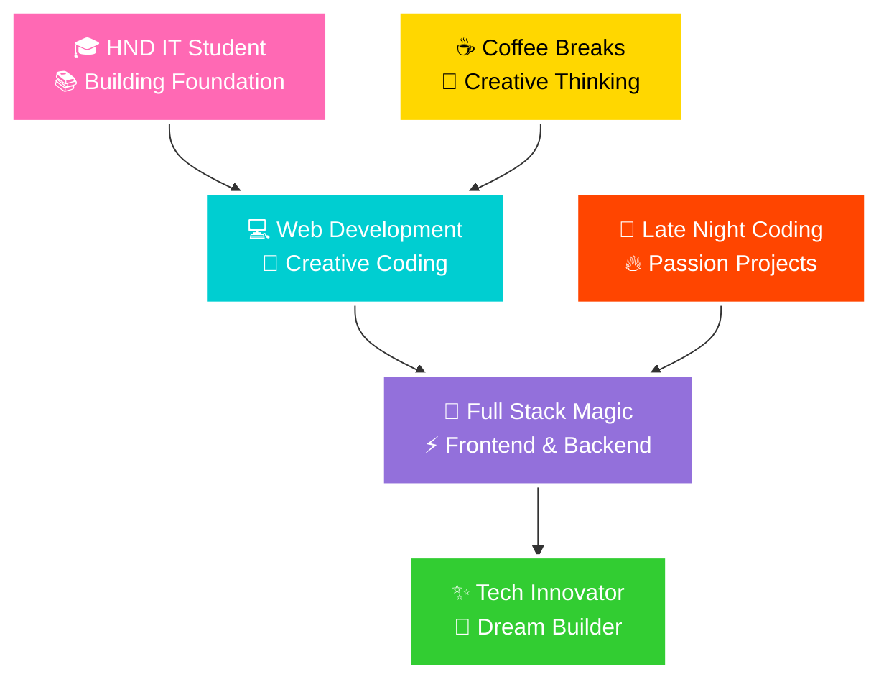

# <div align="center">🌈✨ Hey there! I'm Poorni ✨🌈</div>

<div align="center">
  
</div>


<div align="center">
  
</div>

---

<div align="center">
  
</div>

## 🎨💫 About Me 💫🎨

<div align="left">
  
  
  ```javascript
  const poorni = {
    pronouns: "she/her 💜",
    location: "Sri Lanka 🇱🇰🌺",
    currentlyLearning: "Higher National Diploma in IT 🎓✨",
    passion: ["Web Development 💻", "Creative Design 🎨", "Problem Solving 🧩"],
    favoriteColors: ["💙", "💜", "💖", "💛", "🧡", "❤️", "💚"],
    currentMood: "Excited to code! 🚀✨",
    funFact: "I dream in HTML and wake up in CSS! 🌙💭",
    superpower: "Turning ideas into beautiful websites 🌟"
  };
  ```
</div>

<br clear="right"/>

<div align="center">
  
</div>

---

## 🚀🌈 My Colorful Tech Universe 🌈🚀

<div align="center">

### 💖 Frontend Magic ✨

<br>


### 💜 Backend Power 🔥

<br>


### 🧡 Creative Tools 🎨

<br>


### 💚 Currently Exploring 🌱

<br>


</div>

<div align="center">
  
  
  
</div>

---

## 📊🎭 My Colorful GitHub Journey 🎭📊

<div align="center">
  
  
</div>

<div align="center">
  
</div>

<div align="center">
  
</div>

---

## 🏆🌟 Trophy Collection 🌟🏆

<div align="center">
  
</div>

---

## 🌈✨ My Learning Adventure ✨🌈

<div align="center">


```mermaid
graph TD
    A["🎓 HND IT Student<br/>📚 Building Foundation"] --> B["💻 Web Development<br/>🎨 Creative Coding"]
    B --> C["🚀 Full Stack Magic<br/>⚡ Frontend & Backend"]
    C --> D["✨ Tech Innovator<br/>🌟 Dream Builder"]
    E["☕ Coffee Breaks<br/>💭 Creative Thinking"] --> B
    F["🌙 Late Night Coding<br/>🔥 Passion Projects"] --> C
    
    style A fill:#FF69B4,stroke:#fff,stroke-width:3px,color:#fff
    style B fill:#00CED1,stroke:#fff,stroke-width:3px,color:#fff
    style C fill:#9370DB,stroke:#fff,stroke-width:3px,color:#fff
    style D fill:#32CD32,stroke:#fff,stroke-width:3px,color:#fff
    style E fill:#FFD700,stroke:#fff,stroke-width:3px,color:#000
    style F fill:#FF4500,stroke:#fff,stroke-width:3px,color:#fff
```

</div>

---

## 🦄💫 Fun Rainbow Facts About Me 💫🦄

<div align="center">

| 🌈 Trait | 💖 Description |
|:---:|:---:|
| 🎨 **Creative Coder** | I paint websites with code and love every pixel! |
| 🚀 **Ambitious Dreamer** | Sky's not the limit, it's just the beginning! |
| ☕ **Coffee Wizard** | I brew code with coffee and magic happens ✨ |
| 🌙 **Night Owl** | Best ideas come at 2 AM with neon lights |
| 🦋 **Continuous Learner** | Every bug is a butterfly waiting to emerge |
| 🌟 **Problem Solver** | I turn "it's impossible" into "it's done!" |

</div>

<div align="center">
  
</div>

---

## 🎵🌈 My Current Coding Playlist 🌈🎵

<div align="center">

🎧 **Now Playing:** *Coding in Colors* 🎨  
🔊 **Volume:** Maximum Creativity  
🎶 **Genre:** Electronic Dreams & Lo-fi Magic  
⏯️ **Status:** Always Vibing While Coding  


</div>

---

## 📬🌟 Let's Connect in Color! 🌟📬

<div align="center">
  
  [](https://linkedin.com/in/yourprofile)
  [](https://twitter.com/yourhandle)
  [](mailto:your.email@gmail.com)
  [](https://yourportfolio.com)
  [](https://discord.gg/yourserver)
  [](https://instagram.com/yourprofile)

</div>

---

<div align="center">
  
  
  ### ✨ *"Life is too short for boring code!"* ✨
  ### 🌈 *"Every line of code is a brushstroke on the canvas of imagination"* 🎨
  
  
  
  
</div>

---

<div align="center">
  
</div>

<div align="center">
  
</div>
